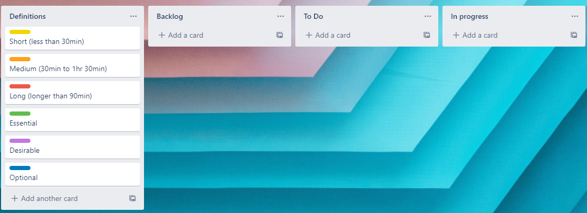

# Terminal Application

### R4 Link to source control repository
https://github.com/Danielbailey309/T1A3-Terminal-Application

## Software Development Plan

### Statement of purpose and scope
This application will let users identify rocks and minerals in their collection. 

(Note that rocks and minerals are used interchangably throughout the documentation of this assignment.)

Rock collection is a common hobby and many people want to start their collection but struggle to identify and keep track of the rocks and minerals they find. I am developing this app to streamline the process of discovering what rock or mineral a user is in posession of and storing it in memory so users can refer back to a list of their collection.

This application is aimed at people of all levels of expertise in rock identification: Those who can't tell quartz from calcite can have their rocks identified for them, and those who are experts in geology can have information on their collection stored in a centralised place.

On running the application, users will be provided with a list of options to choose from. If they choose "Identify", they are asked a series of questions about the piece of earth that they want to identify. Once this process is done, the program will provide a list of the rocks or minerals that fit the criteria that they just inserted. The user then has the option to add any of these rocks to their collection. The user also has the option of adding the rock they just found to the rock database, if their rock isn't on the list. Selecting this option will allow the user to name the rock and update the database with the new rock.

### Features included in application
This application will include three features that allow the user to:
1. Identify rocks/minerals
1. Update the database with new rocks/minerals
1. Save any rock/mineral to their collection.

Upon starting the program, these features will be displayed as options to the user. The user can choose "identify", "update" or "save", which leads to each of these features respectively

#### Identifying rocks/minerals
If the user chooses "identify" as their option, they will be asked a series of questions regarding the rock or mineral that they want identified. These are questions about the colour, type, formation, grain size, streak and hardness. Each of these criteria is checked against the properties of each rock in the database: The program loops through the properties of each rock and If a rock has the specified criteria, it is added to the list.

In pseudocode:

    potentialarray[] = rockarray[]
    for each rock in rockarray[]
        if getscolour == databaserockcolour
            push to potentialarray[]
        end
    end

once this process is done, the system lists all the rocks in the potentialarray[]

If at any point the user inputs a value that corresponds to none of the rocks in the array, there will be an error that tells the user so.

Likewise, if the user inputs an invalid answer to any of the criteria (e.g. inputs "420" when asked for the hardness), they will be asked to input the value again.

#### Updating the database
If the user types "update", a new rock is created. The program then goes through the same process as above, allowing the user to type in all the details of the new rock.

In pseudocode:

    name = gets
    colour = gets
    type = gets
    formation = gets
    grain size = gets
    streak = gets
    hardness = gets

    Rock.new(name, colour, type, formation, grain size, streak, hardness)

As above, if the user inputs the wrong data type for any criteria, an error will occur

#### Saving rocks/minerals to a collection
If the user chooses "save", they are then prompted to type the name of the rock that they want added to their collection. The program then copies this rock from the database to the collection

In pseudocode:
    name = gets
    if rockname is in rockarray[]
        push rock to collectionarray[]
    end

As above, an error will occur if the user inputs the incorrect data type for the rock's name. If the rock isn't in the database, the user is able to reenter their input or add the rock to the database.

### Outline of user interaction
When the application is started, all of the options available to the user are listed individually, as well as a "help" option, which tell the user what each option does. By typing in one of these options, the user can access the associated feature of the program. These features will each guide the user step-by-step through how to use the feature.

Choosing 'List all rocks currently in the database', will simply provide a list of all the rocks that come with the database by default, as well as any that the user has added.

Choosing 'Add a new rock to the database' will run the user through a series of questions about the rock that they want added to the database. These questions are regarding the rock's colour, type, formation, grain size, streak colour and hardness. Additionally, it will ask what the user would like to name the rock they've found.

Choosing 'Identify a rock that I've found' will run them through the same questions as before, and provide them with a list of rocks that meet the criteria that they've entered.

Choosing 'Save a rock from the database to my collection' will allow the user to enter the name of any rock in the database, and it will be saved to their personal collection of rocks.

Choosing 'View my collection' will provide a list of all the rocks that the user has saved to their collection

Choosing 'Get help' will display a help message on how the application works.

Finally, choosing 'Exit' will quit the application"

While identifying rocks or adding a new one to the database, an error will occur if the user enters a hardness that is outside the Moh's scale of hardness (i.e. below 1 or above 10). Additionally, an error will occur if a the program cannot match the rock being identified to any rocks in the database. Finally, an error will occur if the user tries to add a rock to their collection which is not currently in the database.

### Control Flow Diagram

#### Diagram

#### Key

### Implementation Plan

The timeline for which user stories are categorised is like so:

The rest of my implementation plan is like so:

Due to technical reasons, the rest of my user stories can be viewed here:

### Installation and usage

#### Steps for installation

To install the program, simply navigate to DanielBailey_T1A3/src and enter

    ./install_script.sh

into the terminal. After this, the program can be run by entering 

    ruby main.rb

into the terminal. If help is required on program usage, the argument

    --help

can be added onto the run command.

Therefore, to run the program with help, it should look like this:

    ruby main.rb --help

#### Dependencies

This program requires the gems "colorize" and "tty-prompt" to run. The program should automatically install these if the installation instructions are followed correctly.

#### System requirements

It has been reported that tty-prompt doesn't work on some windows systems. This program has been tested on windows and seems to work fine, but for best results use a Mac or Linux system.